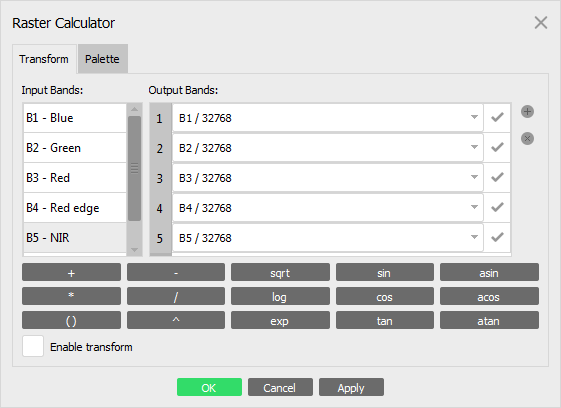

# Metashape-photogrammetry

_[Metashape](https://www.agisoft.com/)_ step-by-step tutorial using GUI and Python console for photogrammetry (point clouds, DEM, mesh, texture and orthomosaic) from arial images.

<br />

## Credits

The tutorial prepared by <a href='https://vietducng.github.io/'>Viet Nguyen</a> (_[Earth Observation and Geoinformation Science Lab](https://geo.uni-greifswald.de/en/chairs/geographie/translate-to-english-fernerkundung-und-geoinformationsverarbeitung/)_ - _[University of Greifswald](https://www.uni-greifswald.de/en/)_) based on

- The _[Geo-SfM](https://unisvalbard.github.io/Geo-SfM/landing-page.html#)_ course from _[The University Centre in Svalbard](https://www.unis.no/)_
- The _[Structure From Motion tutorial](https://pubs.usgs.gov/of/2021/1039/ofr20211039.pdf)_ from USGS
- The _[Drone RGB and Multispectral Imagery Processing Protocol](https://www.tern.org.au/wp-content/uploads/20230829_drone_rgb_multispec_processing.pdf)_ from The University of Queensland.
- And the work from _[Derek Young and Alex Mandel](https://github.com/open-forest-observatory/automate-metashape)_.

_<sup><sub>(https://www.inrae.fr/en/news/remote-sensing-dossier)</sub></sup>_

<br />

## Table of Contents

[Project structure](#project-structure-1)

[Getting started](#getting-started)

- [Metashape-photogrammetry](#metashape-photogrammetry)
  - [Credits](#credits)
  - [Table of Contents](#table-of-contents)
  - [Code and version](#code-and-version)
  - [Project structure](#project-structure)
  - [Getting started](#getting-started)
    - [GUI or automatic with Python code?](#gui-or-automatic-with-python-code)
    - [1. Add photos](#1-add-photos)
    - [2. Estimate image quality](#2-estimate-image-quality)
    - [3. Reflectance calibration](#3-reflectance-calibration)
    - [4. Set primary channel](#4-set-primary-channel)
    - [5. Image projection](#5-image-projection)
    - [6. Align photos](#6-align-photos)
    - [7. Add ground control points](#7-add-ground-control-points)
    - [8. Improve alignment](#8-improve-alignment)
      - [8.1 Optimize Camera Alignment](#81-optimize-camera-alignment)
      - [8.2 Filter uncertain points](#82-filter-uncertain-points)
      - [8.3 Filter by Projection accuracy](#83-filter-by-projection-accuracy)
      - [8.4 Filter by Reprojection Error](#84-filter-by-reprojection-error)
    - [9. Dense point cloud](#9-dense-point-cloud)
      - [9.1. Filter by point confidence](#91-filter-by-point-confidence)
    - [10. Mesh model](#10-mesh-model)
      - [10.1. Filter the mesh](#101-filter-the-mesh)
      - [10.2. Decimate mesh](#102-decimate-mesh)
      - [10.3. Smooth mesh](#103-smooth-mesh)
    - [11. Orthomosaic](#11-orthomosaic)
  - [11.1. Normalizing orthomosaic](#111-normalizing-orthomosaic)
    - [12. DEM](#12-dem)
    - [13. Texture](#13-texture)
  - [Documenting](#documenting)

[Documenting](#documenting)

<br />

## Code and version

The tutorial not only guide the main steps of photogrammetry in Metashape GUI, but there also are <b>Python scripts</b> for those steps to use in Metashape Python console. The scripts were tested for Metashape version 1.8 and 2.1.

<br />

## Project structure

It is recommended to use the standardised project structure (or something similar) throughout all future projects.

    {project_directory} (The folder with all files related to this project)
    |   overview_img.{ext}
    |   description.txt
    ├───config (where you place your configuration files)
            {cfg_0001}.yml
            {cfg_0002}.yml
            ...
    ├───data (where you unzipped the files to)
    ├───────f0001 (The folder with images acquired on the first flight)
    |           {img_0001}.{ext}
    |           {img_0002}.{ext}
    |           ...
    ├───────f0002 (The folder with images acquired on the second flight)
    |           {img_0001}.{ext}
    |           {img_0002}.{ext}
    |           ...
    |       ...
    ├───────f9999 (The folder with images acquired on the last flight)
    |           {img_0001}.{ext}
    |           {img_0002}.{ext}
    |           ...
    ├───────gcps
    |           (...)
    ├───────GNSS
    |           (...)
    ├───export (where you place export models and files)
            ...
    └───metashape (This is where you save your Agisoft Metashape projects to)
            {metashape_project_name}.psx
            .{metashape_project_name}.files
            {metashape_project_name}_processing_report.pdf
            (optionally: {metashape_project_name}.log)

The standardised project structures are important for automated processing and archiving.

<br />

## Getting started

### GUI or automatic with Python code?

Below are step-by-step guildance in Metashape GUI and Python scripts for those steps. For automate workflow, use the GUI for step 1 to step 7 (add GCPs), the next steps can use the code for all-in-one workflow:

> [!TIP]
> <a href='/codes/metashape_1.8/photogramm_from_mesh_Vietpara.py'>Python script for Metashape 1.8 </a> <br></br>
> <a href='/codes/metashape_2.1/photogramm_from_mesh_Vietpara.py'>Python script for Metashape 2.1 </a>

### 1. Add photos

It is helpful to include the subfolder name in the photo file name in Metashape (to differentiate photos from which flight). Below is the [code](/codes/01_rename_photo.py) for Python console to rename all photos to reflect the subfolder they are in.

```python
import Metashape
from pathlib import Path

doc = Metashape.app.document # accesses the current project and document
chunk = doc.chunk # access the active chunk

for c in chunk.cameras: # loops over all cameras in the active chunk
    cp = Path(c.photo.path) # gets the path for each photo
    c.label = str(cp.parent.name) + '/' + cp.name # renames the camera label in the metashape project to include the parent directory of the photo
```

Images from MicaSense RedEdge, MicaSense Altum, Parrot Sequoia and DJI Phantom 4 Multispectral can be loaded at once for all bands. Open Workflow menu and choose _Add Photos_ option. Select all images including reflectance calibration images and click OK button. In the Add Photos dialog choose Multi-camera system option:


Metashape Pro can automatically sort out those calibration images to the special camera folder in the Workspace pane if the image meta-data says that the images are for calibration. The images will be disabled automatically (not to be used in actual processing).

### 2. Estimate image quality

This is done by right clicking any of the _photos_ in a _Chunk_, then selecting _Estimate Image Quality…_, and select all photos to be analysed, as shown in figure below.


Open the _Photos_ pane by clicking _Photos_ in the View menu. Then, make sure to view the details to check the Quality for each image.

> [!TIP]  
> Then, filter on quality and Disable all selected cameras that do not meet the standard. Agisoft recommends a Quality of at least 0.5.

### 3. Reflectance calibration

Open _Tools_ menu and choose _Calibrate Reflectance_ option. Press <i>Locate Panels</i> button:


As a result, the images with the panel will be moved to a separate folder and the masks would be applied to cover everything on the images except the panel itself. If the panels are not located automatically, use the manual approach.

### 4. Set primary channel

For multispectral imagery the main processing steps (e.g., Align photos) are performed on the primary channel. Change the primary channel from the default Blue band to NIR band which is more detailed and sharp.


### 5. Image projection

Go to _Convert_ in _Reference_ panel and select the desired CRS for the project.


### 6. Align photos

Below are recommended settings for photo alignment. The code to use in Python console can be found [here](/codes/02_align_photos.py).


### 7. Add ground control points

Go to _Import Reference_ in the _Reference_ panel and load the csv file.


Follow [this tutorial](https://www.youtube.com/watch?v=G09r5PXqhBc) to set the gcp.

<strong>Personal experience ⚠️</strong>:

GCPs should be set over the study area many enough to correct the position of the orthomosaic. With only few GCPs, the distortion may be not significantly visible in the orthomosaic interms of X, Y values, but can be clealy see in the DEM (Z values).

The Z values from geo-taged photos are relatively good already. So 1 solution could be only using X, Y values from GCPs to correct position of the orthomosaic and DEM, but Z values from photos used from DEM. To do that, set the accuracy of GCPs to 0.005/10 (5mm for X, Y and 10m for Z) and go to <i>Tool</i> -> <i>Camera Calibration</i> -> <i>GPS offset</i> and set camera accuracy to X: 0.05, y: 0.05, Z: 0.02. This way the program will prioritize X, Y values of GCPs and Z value of photo itself for the orthomosaic and DEM.

### 8. Improve alignment

The following optimizations to improve quality of the sparse point cloud including _[Optimize Camera Alignment](#optimize-camera-alignment)_, _[Filter uncertain points](#filtering-uncertain-points)_, _[Filter by Projection accuracy](#filter-by-projection-accuracy)_, _[Filtering by Reprojection Error](#filtering-by-reprojection-error)_. Those optimizations can be automated by Python console using this [code](/codes/03_optimizeCamera_&_filterTiePoint.py).

> [!NOTE]
> Save project and backup data before any destructive actions

#### 8.1 Optimize Camera Alignment

This is done by selecting _Optimize Cameras_ from the _Tools_ menu


Change the model view to show the Point Cloud Variance. Lower values (=blue) are generally better and more constrained.

#### 8.2 Filter uncertain points


A good value to use for uncertainty lever is 15, though make sure do not remove all points by doing so!. A rule of thumb is to select no more than 20% of all points, and then delete these by pressing the Delete key on the keyboard.

> [!TIP]
> After filtering points, it is important to once more optimize the alignment of the points. Doing so by revisiting the [Optimize Camera Alignment](#optimize-camera-alignment)

#### 8.3 Filter by Projection accuracy

This time, select the points based on their _Projection accuracy_, aiming for a final Projection accuracy of 2.


> [!TIP]
> After filtering points, it is important to once more optimize the alignment of the points. Doing so by revisiting the [Optimize Camera Alignment](#optimize-camera-alignment)

#### 8.4 Filter by Reprojection Error

A good value to use here is 0.3, though make sure you do not remove all points by doing so! As a rule of thumb, this final selection of points should leave you with approx. 10% of the points you started off with.


> [!TIP]
> After filtering points, it is important to once more optimize the alignment of the points. Doing so by revisiting the [Optimize Camera Alignment](#optimize-camera-alignment)

### 9. Dense point cloud

Select _Build Point Cloud_ from the _Workflow_ menu. Below are recommended settings, the code to use in Python API can be found [here](/codes/04_build_denseCloud.py).


Visualise the point confidence by clicking the gray triangle next to the nine-dotted icon and selecting _Point Cloud confidence_. The color coding (red = bad, blue = good).

#### 9.1. Filter by point confidence

Open _Tools/Point Cloud_ in the menu and click on _Filter by confidence…_ The dialog that pops up allows you to set minimal and maximal confidences. For example, try setting Min:50 and Max:255. After looking at the difference, reset the filter by clicking on _Reset filter_ within the _Tools/Point Cloud_ menu.

### 10. Mesh model


Selecting _Build Mesh_ from the _Workflow_ menu, you will be able to chose either Dense cloud or Depth map as the source. The code for _Build Mesh_ to use in Python API can be found [here](/codes/05_build_mesh.py).

> [!TIP]  
> Depth maps may lead to better results when dealing with a big number of minor details, but Dense clouds should be used as the source. If you decide to use depth maps as the source data, then make sure to enable _Reuse depth maps_ to save computational time!


#### 10.1. Filter the mesh

Sometimes your mesh has some tiny parts that are not connected to the main model. These can be removed by the _Connected component filter_.


#### 10.2. Decimate mesh

Select Tools-> Mesh->Decimate mesh. Enter an appropriate value, for example, to
halve the number of faces in the original mesh.

#### 10.3. Smooth mesh

Select Tools ->Mesh->Smooth mesh. The strength of smoothing depends on the
complexity of canopy. Three values are
recommended for low, medium, and high smoothing: 50, 100 and 200 respectively.

### 11. Orthomosaic

Select _Build Orthomosaic_ from the _Workflow_ menu. To begin, you have to select the Projection parameter.

- Geographic projectionis often used for aerial photogrammetric surveys.

- Planar projection is helpful when working with models that have vertical surfaces, such as vertical digital outcrop models.

- Cylindrical projection can help reduce distortions when projecting cylindrical objects like tubes, rounded towers, or tunnels.

It is recommended to use _Mesh_ as surface. For complete coverage, enable the _hole filling_ option under _Blending mode_ to fill in any empty areas of the mosaic.


The code for _Build orthomosaic_ to use in Python API can be found [here](/codes/06_build_orthomosaic.py).

## 11.1. Normalizing orthomosaic

Metashape performs the reflectance calibration operation according to <a href='https://support.micasense.com/hc/en-us/articles/215460518-What-are-the-units-of-the-Atlas-GeoTIFF-output'>MicaSense recommendations</a>. So the values in the output bands would still be 16 bit integer values like the input values, but 100% reflectance for each band would correspond to the middle of the available range, i.e. to 32768 value. In case it is necessary to export the reflectance normalized to 0 - 1 range, then it is required to create Output bands in the <i>Raster Calculator</i> dialog and for each one of them input the formula that divides the source value by the normalization factor: B1/32768; B2/32768; B3/32768; B4/32768; B5/32768,etc.:



And then in the <i>Export Orthomosaic</i> dialog select <i>Index Value</i> option in the <i>Raster Transform</i> section.

### 12. DEM

Select _Build DEM_ from the _Workflow_ menu. The code for #Buil DEM# to use in Python API can be found [here](/codes/build_DEM.py).


It is recommended to use _Point Cloud_ as the source data since it provides more accurate results and faster processing.

it ist recommended to keep the interpolation parameter **Disabled** for accurate reconstruction results since only areas corresponding to point cloud or polygonal points are reconstructed. Usually, this method is recommended for Mesh and Tiled Model data source.

### 13. Texture

Open _Build Texture_ from the _Workflow_ menu.


_Texture size/count_ determines the quality of the texture. Anything over 16384 can lead to very large file sizes on your harddisk. On the other hand, anything less than 4096 is probably insufficient. For greatest compatibility, keep the _Texture size_ at 4096, but increase the _count_ to e.g. 5 or 10.

<br />

## Documenting

Open _File/Export_ and select _Generate Report…_ Store the report in the _metashape_ folder with the project file.
